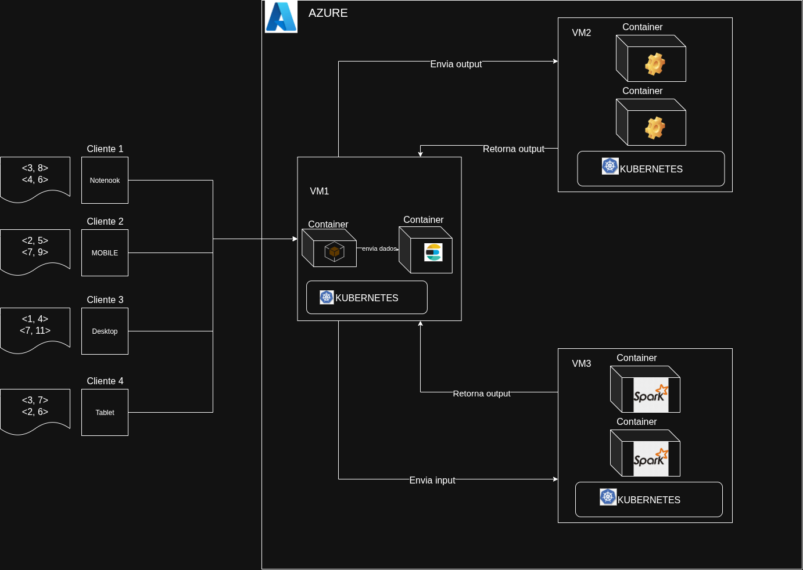

# PSPD-trabalho-final
Repositório para o Trabalho Final da disciplina PSPD da FCTE

Aluno | Matricula
--|--
Artur Vinicius Dias Nunes | 190142421
Henrique Hida | 180113569
João Manoel Barreto Neto | 211039519 
Leonardo Milomes Vitoriano | 201000379
Miguel Matos Costa de Frias Barbosa | 211039635

## Descrição

O projeto consiste em uma aplicação distribuída desenvolvida para orquestração via Kubernetes em um ambiente self-hosted, 
utilizando máquinas virtuais (VMs) provisionadas na plataforma Microsoft Azure. O objetivo principal é implementar um sistema 
de processamento paralelo do "Jogo da Vida" (Game of Life), que pode ser executado com diferentes motores de execução: 
Apache Spark para o processamento distribuído e OpenMP/MPI para processamento paralelo em nível de CPU.

## Arquitetura

A arquitetura do sistema é composta por uma VM principal (vm1) que atua como nó de controle (control-plane) do cluster Kubernetes, responsável por expor uma interface de entrada por meio de conexões socket. Esta interface permite que o usuário envie requisições que contenham os parâmetros do jogo, como tamanho da matriz, número de gerações e motor de execução desejado. As VMs secundárias (vm2, vm3 e vm4) são adicionadas como nós workers ao cluster e são responsáveis por executar as simulações de forma escalável, conforme a disponibilidade de recursos.

O sistema utiliza um cluster Kubernetes autogerenciado (self-hosted), configurado manualmente em cada VM com `kubeadm`. Os pods do cluster são agendados de forma automática para os nós disponíveis, e cada motor de execução (Spark, OpenMP ou MPI) é encapsulado em containers executando jobs especializados. As métricas de desempenho e execução são exportadas em tempo real e armazenadas no Elasticsearch, com visualização e análise feita por meio do Kibana, facilitando a avaliação e comparação entre diferentes técnicas de paralelismo.

A comunicação entre os serviços é realizada por meio de sockets TCP e enviada periodicamente ao stack ELK (ElasticSearch - Kibana). O projeto tem como foco principal a análise de desempenho de algoritmos paralelos em ambientes distribuídos, oferecendo uma estrutura prática e extensível para avaliação de workloads científicos em escala.

A Figura 1 ilustra de forma completa toda a infraestrutura e comunicação entre os serviços.

  

<strong>Figura 1</strong> - Arquitetura geral

